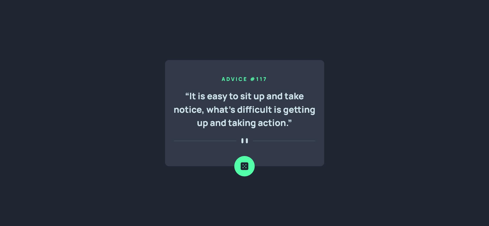

# Frontend Mentor - Advice generator app solution

This is a solution to the [Advice generator app challenge on Frontend Mentor](https://www.frontendmentor.io/challenges/advice-generator-app-QdUG-13db). Frontend Mentor challenges help you improve your coding skills by building realistic projects.

## Table of contents

- [Overview](#overview)
  - [The challenge](#the-challenge)
  - [Screenshot](#screenshot)
  - [Links](#links)
- [My process](#my-process)
  - [Built with](#built-with)
  - [Useful resources](#useful-resources)
- [Author](#author)

## Overview

### The challenge

Users should be able to:

- View the optimal layout for the app depending on their device's screen size
- See hover states for all interactive elements on the page
- Generate a new piece of advice by clicking the dice icon

### Screenshot

### Links

- Solution URL: https://github.com/alexisarte/advice-generator-app
- Live Site URL: https://alexisarte.github.io/advice-generator-app/

## My process

### Built with

- Semantic HTML5 markup
- CSS custom properties
- Flexbox
- Mobile-first workflow
- [React](https://reactjs.org/) - JS library

### Useful resources

- [gh-pages](https://www.npmjs.com/package/gh-pages) - This npm package was very helpful in setting up my project to make deploying faster and automate it.
- [SVGR Playground](https://react-svgr.com/playground/) - This page is good for converting SVG to SVGR (SVG for React).

## Author

- Website - [Alexis Rodriguez](https://alexis-rodriguez.tech/)
- Frontend Mentor - [@alexisarte](https://www.frontendmentor.io/profile/alexisarte)
- Twitter - [@AlexisR95815658](https://twitter.com/AlexisR95815658)

